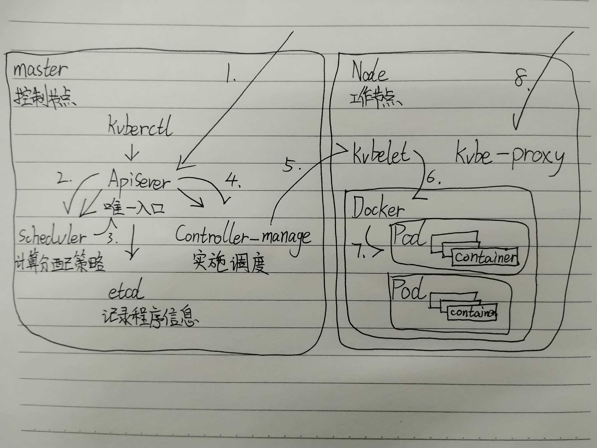

# Kubernetes 基础

为了解决容器编排问题，发明了容器编排工具，其中市场占额最大的就是 Kubernetes。

Kubernetes 本质是一组服务器集群。

---

## Kubernetes 的六大功能

1.  **自我修复**
2.  **弹性伸缩**
3.  **服务发现**
4.  **负载均衡**
5.  **版本回退**
6.  **存储编排**

---

## Kubernetes 基本组成

**节点、容器、存储、服务**

*   **节点 (Node)**：实际运行应用程序的地方（物理机/虚拟机）。
    *   **职责**：托管 Pod（容器的集合）。

### 架构图

>  

> **Pod 是 Kubernetes 调度和管理的最小逻辑单元**  
---

## Kubernetes 概念

*   **Master**：控制节点。
*   **Node**：工作节点。
*   **Pod**：Kubernetes 最小控制单元。
*   **Controller**：通过它来实现对 Pod 的管理。

---

## Service, Label, NameSpace

*   **Service**：Pod 对外的统一入口。
*   **Label**：对 Pod 打标签并分类。
*   **NameSpace**：隔离 Pod 的运行环境。

---

## 集群环境搭建

### 集群类型

*   **一主多从**：搭建简单，有单机故障风险，适合测试环境。
*   **多主多从**：复杂，安全，生产。

### 安装方式

*   **minikube**：快速搭建单节点的工具。
*   **kubeadm**：快速搭建集群的工具。
*   **二进制包**：官网下载二进制包。

### 主机规划

| 作用   | IP地址        | 操作系统       | 配置          |
| :----- | :------------ | :------------- | :------------ |
| Master | 192.168.109.100 | CentOS 7.5 基础设施服务器  |    2颗CPU，2G内存，50G硬盘           |
| Node 1 | 192.168.109.101 |    CentOS 7.5 基础设施服务器   |        2颗CPU，2G内存，50G硬盘       |
| Node 2 | 192.168.109.102 |        CentOS 7.5 基础设施服务器        |      2颗CPU，2G内存，50G硬盘         |
